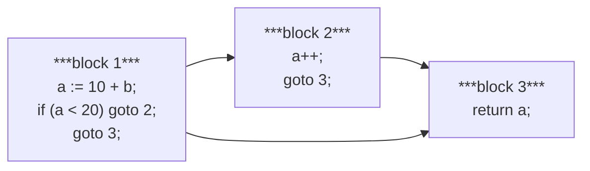
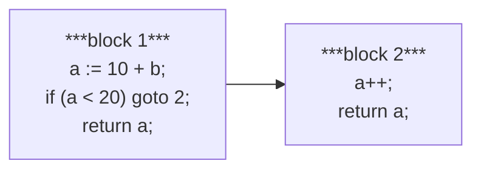
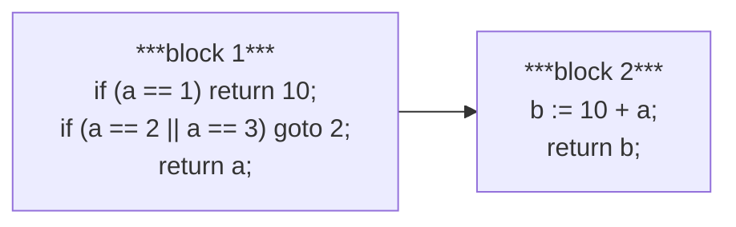
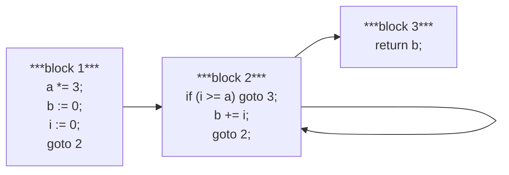
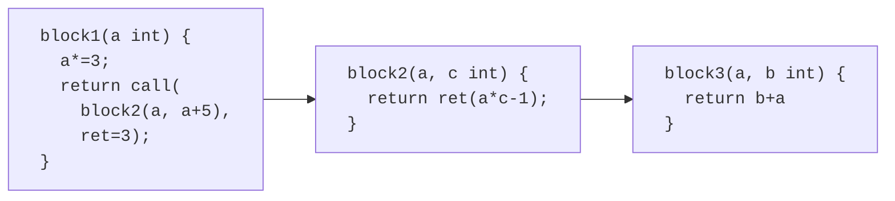
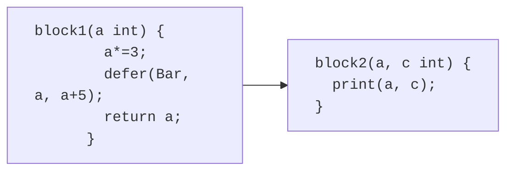

# Block Representation

*This documentation is design notes and ideas.*
*They may not reflect the final implementation.*

Gozer uses an intermediate representation to describe the Go code in blocks.
The blocks can be easily optimized and translated into TypeScript in a way to
allow pseudo multithreaded execution. The blocks perform similar analysis
as [SSA](https://en.wikipedia.org/wiki/Static_single-assignment_form) to
determine which data is passed in and out of blocks.

- [Block Representation](#block-representation)
  - [Scheduler](#scheduler)
  - [Application](#application)
  - [Thread](#thread)
  - [Function Block](#function-block)
  - [Statement Block](#statement-block)
    - [Statement Block Examples](#statement-block-examples)
    - [Block Control Methods](#block-control-methods)

## Scheduler

The schedular controls threads to handle making a pseudo multithreaded
execution in a single thread environment. The schedular manages
multiple applications at the same time. The schedular will periodically
swap threads when blocks return to it and will periodically sleep
to allow other events outside of the scheduler to run.

## Application

An application represents a single running application with several threads.
The application will run mostly in isolation as much as possible but may use
the same scheduler as another application.

When an application is started up it will be given some options for how to run
the application. The exported functions for the application will be accessed
via the application object returned when the application is started.
The application object will allow the application to be killed.
When an exported function is called, it will be async and return a promise.
The function call will be processed as its own thread.
When an application is started, any inits and the main method will be called.

The application options are things like "keep alive" that will keep the
application alive even if the main method exits, all threads have exited,
a panic reached the bottom of an empty thread, threads are detected to be
dead locked, etc. The only thing that will kill the application with
"keep alive" is if the application object itself is killed.

Other application options may be something like "profile" that will
record the schedulers timing information for functions to profile the
application's execution. Options to redirect Stdout, Stderr, and
build-in print methods. Options to adjust the amount of time between
a possible swap and adjust how often the scheduler should sleep
to allow other events to pump. An optional timeout may be given that will
automatically kill the application if it takes longer than the given time.
If the application contains tests, benchmarks, examples, etc, then options
to control which tests should be run can be used.

## Thread

A thread represents a single execution.
Each thread will be given a unique id to identify the thread with.
It contains information about the current call stack, which locks it has gained,
the value stack, current panic state, etc.

## Function Block

A function block describes an entry point into a collection of
[statement blocks](#statement-block).
Function blocks represents information about exported functions and
provides a method for calling them from external to the transpiled code.

## Statement Block

Statement blocks contain at least one statement such as variable assignment,
mathematics, simple non-blocking calls, etc. A block will not have any
flow control statements like if-statements (not including conditional jumps),
for-loops, method calls, switches, etc.
The block returns information about which block to goto next (jump) or
a return (ret), that is a jump to a a previously specified block.

Blocks always start from the first statement and runs until the last unless
there is a conditional jump to leave the block early.
While a block is running, there will be no thread swapping.
When switching between blocks, the scheduler may cause a thread swap then.

Except for the entry block for a function, each block should have two or more
paths of flow control going to it. If there isn't then the two blocks should
be joined into a single block with any early exit using a conditional jump.

All the blocks for an entire package are stored in a single list so that all
blocks in that package can be indexed. That index is used to perform the jump.
When jumping across packages, the package object and the index pair indicate
which method or block to jump into.

### Statement Block Examples

When an if-statement returns to the main flow through a method,
the if-statement will split the method so that the if-statement's body
is finished it can jump to rejoin the main flow.

```Go
func Foo(b int) int {
    a := 10 + b
    if a < 20 {
        a++
    }
    return a
}
```



When an if-statement is a terminator so that it doesn't rejoin the main flow,
the body of the if-statement is in its own block but the main flow can
continue past the conditional jump since nothing is going to rejoin the main
flow after the conditional jump.

This could be simplified into one block with the conditional jump instead
simplified into `if (a < 20) return a+1`, but more complex if-statement
bodies will not be able to be simplified like that. SSA will help determine
if such a simplification can be done.

```Go
func Foo(b int) int {
    a := 10 + b
    if a < 20 {
        a++
        return a
    }
    return a
}
```



A switch statement can be left as a switch statement in the target language
if the switch is simple enough. In that case the switch works just like
a conditional jump. For more complicated switch statements each case body
may become a new block if needed.

In this example the switch is a terminator so no block has to be created
after the switch to handle the end of the switch. If only one case doesn't
terminate, that case can be joined with after the switch.

```Go
func Foo(a int) int {
    switch a {
    case 1:
        return 10
    case 2, 3:
        b := 10 + a
        return b
    default:
        return a
    }
}
```



The following example shows a loop. The loop is handled by a block having
a goto that goes back to itself. The conditional jump will exit the loop.
In this example there is a block for the return but the conditional jump
in block 2 could be simplified to be `if (i < a) return b`.

```Go
func Foo(a int) int {
    a *= 3
    b := 0
    for i := 0; i < a; i++ {
        b += i
    }
    return b
}
```



In this example one function calls another function.
When a function call is made, the ret block index is set to the block to jump
to after the call is returned from.

Each block is a function in the target language. When calling a black, a
closure or object (or just an index and parameter list) will be used to
create the call with the correct parameters needed for the next block.
Values for the return block will be stored along with the block to goto
after the call is returned.

When the scheduler is ready to step into the next block it will call the
closure to start the block. The block runs and eventually returns.
The scheduler adds the returned values after the stored values and invokes
the next block.

```Go
func Foo(a int) int {
    a *= 3
    b := Bar(a, a + 5)
    return b + a
} 

func Bar(a, c int) int {
    return a * c - 1
}
```



Defer is similar to a function call except it injects the call into the
scheduler stack to be called before returning from a function call.
The defers are labelled differently by the scheduler so that they are called
without consuming the return values from the function block.
If the thread is set to panic, all other blocks in the function are
skipped but the defers are still called. If the panic is recovered from
the defers continue to call and the function returns like it normally does.

```Go
func Foo(a int) int {
    a *= 3
    defer Bar(a, a + 5)
    return a
} 

func Bar(a, c int) {
    print(a, c)
}
```



### Block Control Methods

The block control methods typically created the value that is returned
from a block about the next block that should be called.
These values are created with methods from the scheduler package.
Some block control methods only change the state of the running thread.

- **goto**: Creates a block return value.
  It is called like `return goto(block index, [args])`.
  This will set the thread to call the given block next without pushing anything
  onto the call stack as would happen when calling another function.

- **call**: Creates a block return value.
  It is called like `return call(follow index, [follow args],`
  `call index, [call args])`.
  This adds the "follow" information to the call stack so that when the call
  returns the thread will continue by calling the follow block.
  The "follow args" are the arguments that are passed into the "follow" block
  along with any return values from the "call" block.
  The scheduler will call the next block with the "call" block information.

- **defer**: Does not create a block return value.
  It is called like `defer(block index, [args])`.
  This adds the deferred block into the current functions state such that
  as the function is exited, this will be called before the "follow" is called.
  If the thread is panicking, the defer will be called but the "follow" will
  be skipped.

- **panic**: Creates a block return value.
  It is called like `return panic(panicked value)`.
  This causes the function to end and the defers are called. The panic
  is set in the thread and skipping all blocks but the deferred ones will
  continue until the panic is recovered or the thread is empty.
  
  If a panic reaches the bottom of the thread and the thread is then empty.
  The application will exit, all threads are stopped, and the panic is printed
  to Stderr, the same as happens in Go.

- **recover**: Does not create a block return value.
  It is called like `value := recover()` and will return any panic from the
  thread and clear out that panic.

- **go**: Does not create a block return value.
  It is called like `go(block index, [block args])`.
  This will create a new thread that will start by calling the given block
  index with the given arguments. The current thread will continue
  running until the end of the block then maybe swapped out.

- **send**: Creates a block return value.
  It is called like `return send(channel, value, follow index, [follow args])`.
  This will suspend the current block if needed to handle the send.
  Once the value is sent, the "follow" block is called.

- **receive**: Creates a block return value.
  It is called like `return receive(channel, follow index, [follow args])`.
  This will suspend the current block if needed to handle the receive.
  Once a value is received, the "follow" block is called and the received
  value is added into the follow arguments the same way a returned value
  from a call is done.

  When a channel has a value sent to it, it will check if any thread is
  waiting for a receive. If there is, the value will be put into that
  thread so that no other thread gets the value and that thread is
  taken out of suspend. If multiple threads are waiting, the thead
  to receive the value is random, the same as Go.
  Otherwise, if no threads are waiting to receive, the value is added into
  the channel's queue.

- **trySend**: Does not create a block return value.
  It is called like `sent := trySend(channel, value)`.
  This will try to send a value on a channel but will not suspend if the
  channel is not ready.

- **tryReceive**: Does not create a block return value.
  It is called like `value, received := tryReceive(channel)`.
  This will try to receive a value from a channel but will not suspend if
  the channel is not ready.

- **select**: Creates a block return value.
  It is called like `return select([send/receive block return values],`
  `default index, [default args])`.
  This will be used to wait for a send or receive on one or more channels.
  This is used for where there call is blocking or not blocking.

- **lock**: Creates a block return value.
  It is called like `return lock(lock id, follow index, [follow args])`.
  This will await until this thread can gain the lock with the lock id.
  Once the lock is gained, then "follow" is called.

  If thread X is awaiting lock A and has gained lock B, and
  thread Y is awaiting lock B while it has gained lock A, then
  those threads are deadlocked. Either the whole application will be
  killed when a deadlock is detected or if the application was run
  with a "keep alive" option, then only those threads will be killed
  and an error will be printed. When a thread is killed, any locks
  it had gained will be unlocked.
  A matrix (may be stored as a graph or not kept in memory) will be
  used to determine if several threads in a ring are deadlocked.

- **tryLock**: Does not create a block return value.
  It is called like `locked := tryLock(lock id)`.
  This will try to gain the lock with the lock id, otherwise it will
  return false.

- **unlock**: Does not create a block return value.
  It is called like `unlocked := unlock(lock id)`.
  This will try to unlock the lock with the lock id. If the lock was not
  locked by this thread or wasn't locked at all, this will return false.

- **sleep**: Creates a block return value.
  It is called like `return sleep(duration, follow index, [follow args])`.
  This will suspend the current thread for the given amount of time.

- **suspend**: Creates a block return value.
  It is called like `return suspend(follow index, [follow args])`.
  This will suspend the current thread until another thread calls `resume`.

- **resume**: Does not create a block return value.
  It is called like `resumed := resume(thread id)`.
  This will unsuspend the thread with the given id, if that thread is
  suspended, otherwise it will return false if the thread is waiting
  on a channel, no longer running, or no suspended. The current thread
  will not be blocked by this call and will continue after.

- **kill**: Does not create a block return value.
  It is called like `killed := kill(thread id)`.
  This will remove the thread with the current id, if that thread is
  asleep, suspended, awaiting a channel, or was just paused.
  When a thread is killed, any locks it had gained will be unlocked.
  If the thread doesn't exist, has ended, or is the same id as the
  current thread, false will return.

  Kill can be called on the main thread. If the main thread is killed
  then all threads will exit. Since kill is not a blocking call, the
  application is in a zombie state until the current block is finished.
  If a "keep alive" option was used when starting an application,
  then killing the main thread is the same as killing any other thread.

- **threadId**: Does not create a block return value.
  It is called like `num := threadId()`.
  This will return the current threads id.

- **callStack**: Does not create a block return value.
  It is called like `stack := callStack()`.
  This will return an object that can be queried about the current
  stack of function calls.

- **status**: Does not create a block return value.
  It is called like `s := status(thread id)`.
  This will return the current status of the thread as an enumerator.

- **mainSuspend**: Creates a block return value.
  It is called like `return mainSuspend(follow index, [follow args])`.
  It can only be called by the main method to suspend the main method
  until all other threads have exited, then the "follow" will be called.
  This is useful for kicking off a bunch of processing that must be done
  asynchronously and the application will be kept alive until the other
  threads have finished. Otherwise, when main exists, all other threads
  will exit.

  The application can also be started with a "keep alive" option that
  will make the application not exit when the main method exits. It
  will also make a panic reaching an empty thread will not kill all other
  threads.
